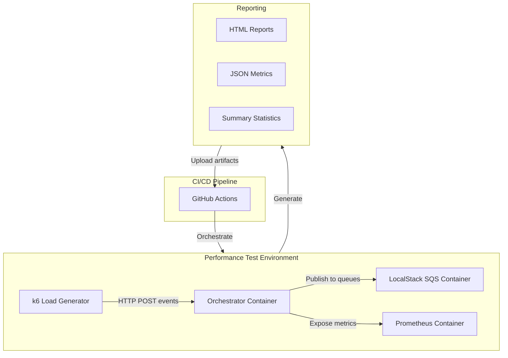

# Automated Performance Testing Setup

## Overview

This plan implements a comprehensive performance testing strategy using k6 for testing, Docker containers for isolation, and GitHub Actions for CI/CD automation. The solution will validate your orchestrator can handle 1000-10000 events/second and identify performance bottlenecks.

## Architecture



## Key Components

### 1. k6 Test Scripts

Create three performance test scenarios in `perf-tests/` directory:

**Load Test** ([`perf-tests/load-test.js`](perf-tests/load-test.js))
- Simulates expected production load
- Gradual ramp-up: 0 → 100 → 500 → 1000 VUs over 5 minutes
- Steady state: 1000 VUs for 10 minutes
- Ramp-down: 1000 → 0 over 2 minutes
- Target: Sustain 2000-5000 events/sec
- Validates: p95 latency < 500ms, error rate < 1%

**Stress Test** ([`perf-tests/stress-test.js`](perf-tests/stress-test.js))
- Finds breaking point
- Aggressive ramp-up: 0 → 5000 VUs over 10 minutes
- Identifies: Max throughput, resource limits, failure modes
- Target: Push beyond 10000 events/sec until degradation

**Spike Test** ([`perf-tests/spike-test.js`](perf-tests/spike-test.js))
- Sudden traffic bursts
- Pattern: baseline → 10x spike → baseline (repeat)
- Validates: Recovery time, queue behavior

Test scripts will:
- Use bulk NDJSON API endpoint (`/api/orchestrator/events/bulk-ndjson`)
- Generate realistic order payloads with varying customer tiers
- Include custom metrics: events/sec, routing success rate, queue depth
- Set thresholds for pass/fail criteria

### 2. Docker Compose for Performance Testing

Create [`docker-compose.perf.yml`](docker-compose.perf.yml) with:

**Services:**
- `orchestrator`: Your app container (resource-limited for realistic testing)
  - CPU: 2 cores
  - Memory: 2GB
  - Scale to 1-3 instances for horizontal scaling tests
- `localstack`: SQS queue backend
- `prometheus`: Metrics collection from orchestrator
- `grafana`: Real-time dashboards (optional, for manual testing)
- `k6`: Load generator service

**Networking:** Isolated Docker network with service discovery

**Volumes:** Share test data and results between containers

### 3. GitHub Actions Workflow

Create [`.github/workflows/performance-test.yml`](.github/workflows/performance-test.yml):

**Triggers:**
- Manual dispatch (workflow_dispatch)
- Scheduled: Weekly on Sunday at 2 AM
- Optional: On PR with label `performance-test`

**Jobs:**

**Job 1: Load Test**
- Spin up docker-compose.perf.yml
- Wait for orchestrator health check
- Run k6 load test
- Collect metrics and logs
- Generate HTML report
- Upload artifacts (reports, logs, metrics)

**Job 2: Stress Test**
- Similar to load test but with stress-test.js
- Longer timeout (30 minutes)

**Matrix Strategy:** Optionally test multiple configurations:
- Single instance vs. 3 replicas
- Different JVM heap sizes
- Different queue configurations

### 4. Test Data Management

Leverage existing [`examples/test-orders-2500.jsonl`](examples/test-orders-2500.jsonl):
- Mount as read-only volume in k6 container
- k6 reads and sends batches via bulk API
- Generate additional test data files for longer tests using script

Create [`perf-tests/generate-test-data.js`](perf-tests/generate-test-data.js):
- Node.js script to generate N events in JSONL format
- Configurable: event types, customer tiers, order values
- Output: `test-data-{size}.jsonl` files

### 5. Metrics and Thresholds

**k6 Custom Metrics:**
```javascript
import { Counter, Rate, Trend } from 'k6/metrics';

const eventsSubmitted = new Counter('events_submitted');
const eventErrors = new Rate('event_errors');
const eventLatency = new Trend('event_latency');
```

**Thresholds (Pass/Fail Criteria):**
- HTTP success rate > 99%
- p95 latency < 500ms
- p99 latency < 1000ms
- Throughput > 2000 events/sec (load test)
- Zero 5xx errors under normal load

### 6. Monitoring and Observability

**Prometheus Integration:**
- Orchestrator already exposes `/actuator/prometheus`
- Configure Prometheus to scrape during tests
- Capture: JVM metrics, custom orchestrator metrics, SQS queue depth

**k6 Output:**
- JSON export: `k6 run --out json=results.json`
- HTML report using `k6-reporter` or custom script
- Summary statistics to stdout

**Queue Monitoring:**
- Integrate existing [`scripts/queue-stats.sh`](scripts/queue-stats.sh) into test lifecycle
- Capture queue depths before/during/after tests
- Validate: Queues drain properly, no message loss

### 7. Results Analysis and Reporting

**Automated Report Generation:**
- Parse k6 JSON output
- Generate HTML dashboard with:
  - Throughput graphs
  - Latency histograms (p50, p95, p99)
  - Error rate over time
  - Resource utilization
  - Queue depth trends
- Upload as GitHub Actions artifact
- Optional: Post summary as PR comment

**Historical Tracking:**
- Store test results in S3 or git branch
- Compare current run vs. baseline
- Detect performance regressions

### 8. Configuration Files

**k6 Configuration** ([`perf-tests/k6.config.js`](perf-tests/k6.config.js)):
- Shared configuration for all test scenarios
- Environment variables for orchestrator URL
- Reusable functions for event generation

**Environment Variables:**
```bash
ORCHESTRATOR_URL=http://orchestrator:8080
TEST_DURATION=10m
VUS=1000
EVENTS_PER_REQUEST=100
```

## File Structure

```
stateless-orchestrator-spring-boot/
├── .github/
│   └── workflows/
│       ├── docker-build-push.yml (existing)
│       └── performance-test.yml (new)
├── docker-compose.perf.yml (new)
├── perf-tests/ (new directory)
│   ├── k6.config.js
│   ├── load-test.js
│   ├── stress-test.js
│   ├── spike-test.js
│   ├── generate-test-data.js
│   ├── test-data/ (generated files)
│   └── results/ (test output)
├── docs/
│   └── PERFORMANCE_TESTING.md (new documentation)
├── scripts/
│   ├── run-perf-test-local.sh (new)
│   └── analyze-results.sh (new)
└── examples/
    └── test-orders-2500.jsonl (existing)
```

## Implementation Steps

### Step 1: Create k6 Test Scripts
- Write load-test.js with gradual ramp-up scenario
- Write stress-test.js with aggressive scaling
- Write spike-test.js for burst testing
- Create shared k6.config.js for common utilities
- Define custom metrics and thresholds

### Step 2: Docker Compose Performance Environment
- Create docker-compose.perf.yml with all services
- Configure resource limits on orchestrator
- Add Prometheus and Grafana services
- Set up health checks and dependencies
- Create isolated network

### Step 3: GitHub Actions Workflow
- Create performance-test.yml workflow
- Add jobs for load and stress tests
- Configure artifact uploads
- Add reporting and notifications
- Set up scheduled runs

### Step 4: Test Data Generation
- Create generate-test-data.js script
- Generate larger test datasets (10k, 50k, 100k events)
- Commit small datasets, generate large ones in CI

### Step 5: Monitoring Integration
- Configure Prometheus scraping
- Create Grafana dashboard (optional)
- Integrate queue monitoring scripts
- Add custom metrics collection

### Step 6: Results Analysis
- Create analyze-results.sh script
- Build HTML report generator
- Set up artifact management
- Configure pass/fail criteria

### Step 7: Documentation
- Write PERFORMANCE_TESTING.md guide
- Document how to run tests locally
- Document CI/CD integration
- Add troubleshooting section

## Usage Examples

**Local Execution:**
```bash
# Start performance test environment
docker-compose -f docker-compose.perf.yml up -d

# Wait for services to be ready
./scripts/wait-for-services.sh

# Run load test
docker-compose -f docker-compose.perf.yml run k6 run /scripts/load-test.js

# View results
open perf-tests/results/report.html

# Cleanup
docker-compose -f docker-compose.perf.yml down
```

**CI/CD Execution:**
```bash
# Manual trigger via GitHub UI or CLI
gh workflow run performance-test.yml

# With parameters
gh workflow run performance-test.yml \
  -f test_type=stress \
  -f duration=15m \
  -f vus=2000
```

## Performance Targets

| Metric | Load Test Target | Stress Test Goal |
|--------|------------------|------------------|
| Throughput | 2000-5000 events/sec | Find max (target >10k) |
| p95 Latency | < 500ms | Track degradation point |
| p99 Latency | < 1000ms | Acceptable under stress |
| Error Rate | < 1% | < 5% at breaking point |
| Queue Depth | Steady state | Monitor buildup |
| Memory | < 1.5GB | Track growth |
| CPU | < 80% | Identify bottleneck |

## Benefits

- **Automated**: Runs in CI/CD without manual intervention
- **Isolated**: Containers ensure consistent test environment
- **Scalable**: Easy to adjust load levels and scenarios
- **Observable**: Rich metrics and visualizations
- **Repeatable**: Deterministic results, version-controlled tests
- **Fast Feedback**: Detect regressions before production
- **Realistic**: Tests full stack including queue infrastructure

## Next Steps After Implementation

1. Run baseline tests to establish current performance profile
2. Optimize based on bottlenecks found
3. Set up alerts for performance degradations in CI
4. Integrate with production monitoring for comparison
5. Schedule regular endurance tests (24-hour runs)
